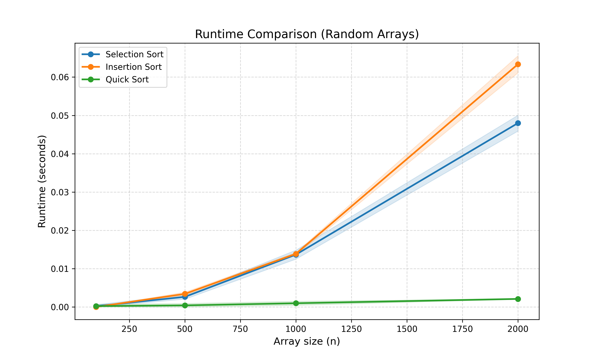
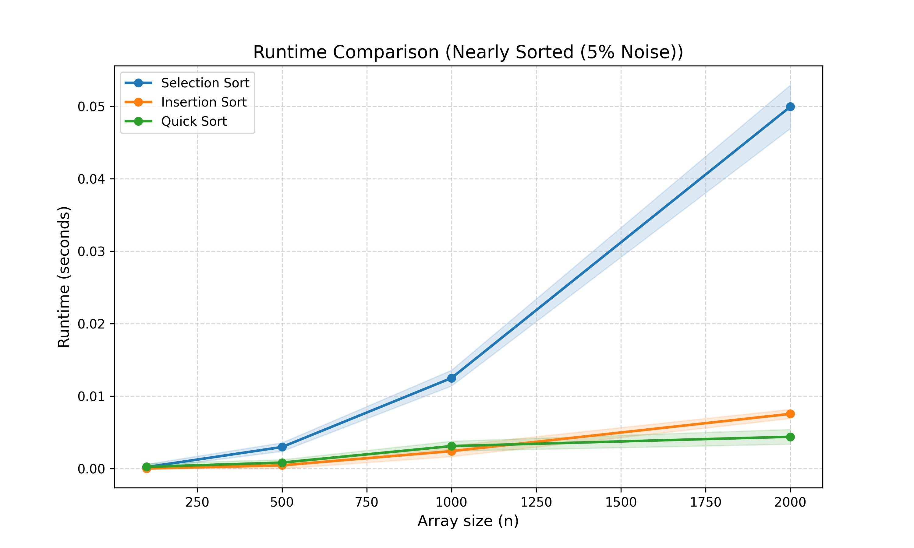

# Sorting Algorithms Benchmark
**Students Names:** Ido Arvili and Shahar Khudadadi

## Selected Algorithms
This project implements and analyzes the performance of classic sorting algorithms.
we selected the following three algorithms to compare:
1. **Selection Sort** (Algorithm ID: 2)
2. **Insertion Sort** (Algorithm ID: 3)
3. **Quick Sort** (Algorithm ID: 5)


The goal is to compare their runtimes on random data versus nearly sorted data, including a visualization of the mean runtime and standard deviation.

note: We chose to implement algorithms that differ in their time complexity, in order to show the vast difference in complexity for big n inputs. thus, we chose to implement "Quick sort", which has O(n log n) complexity, as opposed to the O(n^2) complexity of Selection and Insertion sort.


## Features
- **Part A:** Implementation of Sorting Algorithms.
- **Part B & C:** Experiments with Random and Nearly Sorted arrays.
- **Part D:** Command-Line Interface (CLI) to run experiments with custom parameters.
- **Visualization:** Generates plots with shaded error bars showing standard deviation.

## How to Run

To generate the results, run the following commands in your terminal:

**Part B: Random Arrays (Generates result1.png)**
```bash
python run_experiments.py -a 2 3 5 -s 100 500 1000 2000 -r 5
```

**Part C: Nearly Sorted Arrays with 5% Noise (Generates result2.png)**
```bash
python run_experiments.py -a 2 3 5 -s 100 500 1000 2000 -e 1 -r 5
```

## Results Analysis 
**Part B: Random Arrays**



In the random arrays experiment, we can see the time complexities translating in compare of the 3 different sorting methods.
Quick Sort outperforms the others. Quick sort graph remains nearly flat at the bottom of the graph because its runtime complexity is (as we learned in class) O(n log n).
Selection Sort and Insertion Sort both have a growing curve, confirming their O(n^2) time complexity on large random arrays.


**Part C: Nearly Sorted Arrays (5% Noise)**



In this experiment we tested arrays that are already sorted but have 5% random noise (swaps).
We can notice several findings:

1) **Insertion Sort** runtime lowers, compared to the first experiment. That is because it only shifts elements when necessary, it efficiently skips over the already sorted elements, having linear time O(n) as we learned in class.
2) **Selection Sort** remains similar to Part B. It must scan the entire unsorted section to find the minimum element every single time, needing O(n^2) operations regardless of the array's initial order.
3) **Quick Sort:** is still highly efficient and fast. However, we can see that for very small n, it initially runs slower than Insertion Sort. This is due to the overhead of its recursive complexity, which makes it less efficient for lower n.

